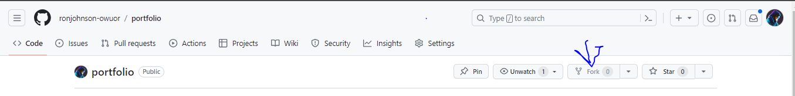
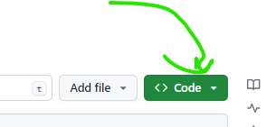
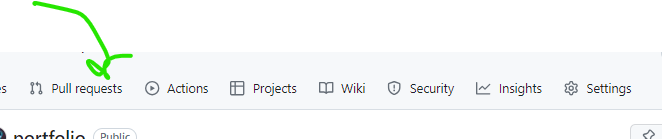

<h1>Instructions</h1>
first you need to have:
<ul>
<li>github account</li>
<li>you need github to be installed</li>
</ul>
You can install git using this link  <a href="https://git-scm.com/download/win">install git</a>
after installing go to the code repository by clicking this link <a href="https://github.com/ronjohnson-owuor/portfolio">code repository</a>
2.Now after visiting the repository you need to fork it to your own github account.

<label> click on the for icon </label>
After you have forked your repository  open your cmd and type this or copy the code below:
<code>cd Desktop</code>
<code>git clone <copy the link of forked repository></code>
<i>NOTE:dont copy the link to my repository copy the link of the repository you had forked from my repository.You can find the link here as shown in the image below</i>

example inafaa kuwa hivi
<code>git clone https://github.com/your-account/forked-repository</code>

Then type this after cloning the repository:
<code>cd your <repository name (replace with actuall name)> </code>
<code>code .</code> typ this if you have vscode installed

From here you can now make changes write new code ,fix bugs etc.
After making changes you now type:
<code>git init</code>
<code>git add .</code>
<code>git commit -m "replace with what you have changed"</code>
<code>git remote add origin (link to your forked repository)</code>
<code>git push</code>

after you have pushed your changes to your github go back to your forked repository and then create a new pull request
show in the image below

write what you have changed and then wait for it live.

<h1>If you are facing any trouble share it in the whatsapp group</h1>

our live website link is this one:
<a href="">our website</a>
